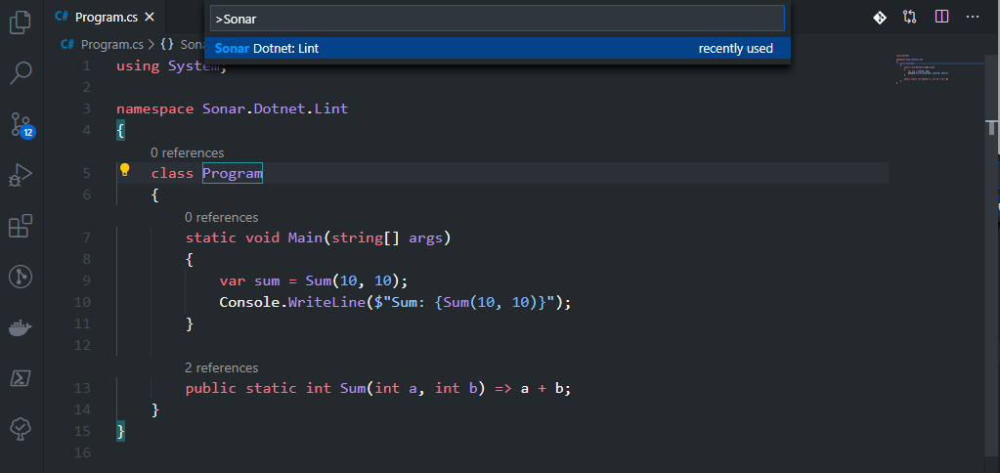
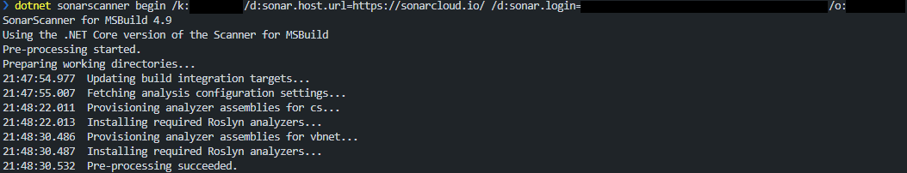
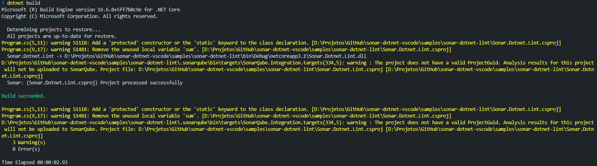
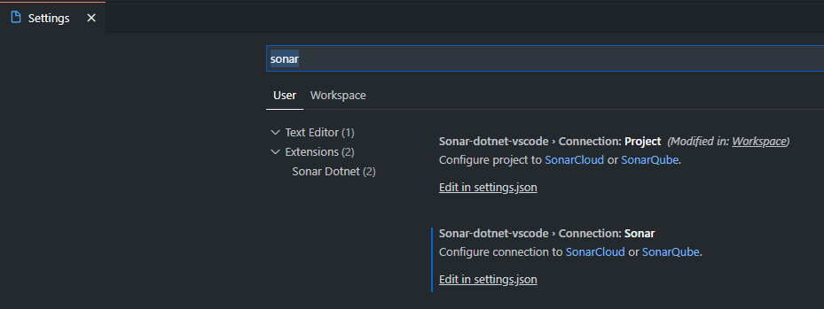

# Sonar Dotnet for Visual Studio Code


Sonar Dotnet is an Visual Studio Code extensions that helps you detect and fix quality issues as you write code in C# using Visual Studio Code.

## Features

Open the **Command Palette** and search *Sonar Dotnet*.



## How to Use

### Lint

1. Set your desired path in terminal
2. Select **Sonar Dotnet: Lint** in Command Palette

**Result:**



3. Execute *dotnet build* command

**Result:**



Once configured in the project it is no longer necessary to run the lint again.

## Requirements

The Sonar Dotnet needs a [.NET Core 2.0+](https://dotnet.microsoft.com/download).

## Extension Settings

Configure *organizationKey, token and serverUrl* properties in user settings:



Field *serverUrl* is **optional**. Server url default is SonarCloud: https://sonarcloud.io.

```json
{
    "sonar-dotnet-vscode.connection.sonar": {
        "organizationKey": "<myOrganizationKey>",
        "token": "<myToken>",
        "serverUrl": "<myServerUrl>"
    }
}
```

Configure *project key* in configuration file **.vscode/settings.json**.

```json
{
    "sonar-dotnet-vscode.connection.project": {
        "projectKey": "<myProjectKey>"
    }
}

```

## Release Notes

See the [CHANGELOG](./CHANGELOG) for more information.

## License

Licensed under the [MIT](./License)
